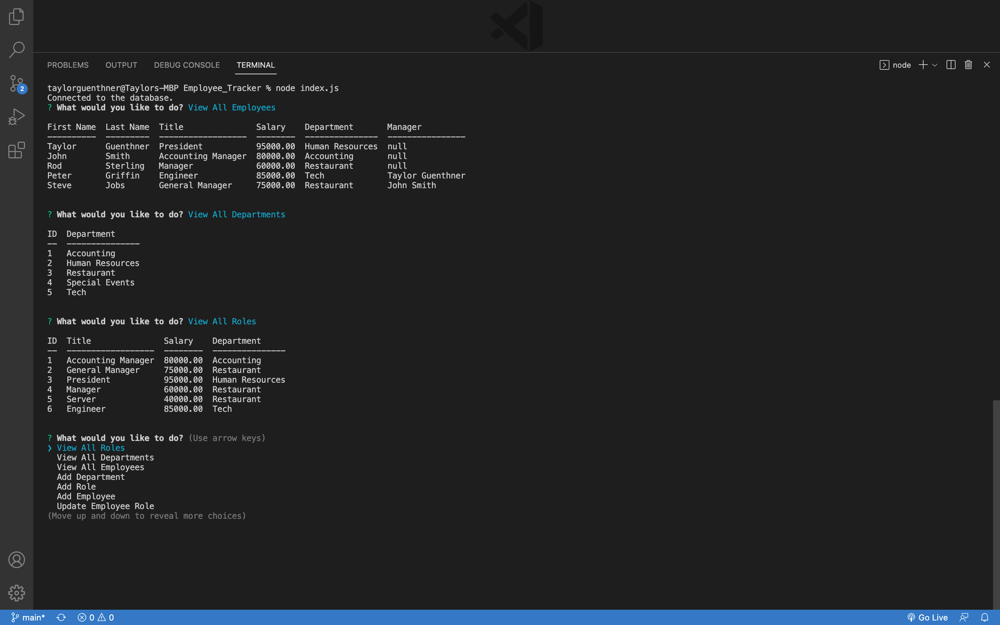

# Employee Tracker

This application allows you to store general information about their employees including name, title, salary, department and manager they report to through a MYSQL database.
Upon loading the application you are give a prompt of selections to decide how you would like to view or manipulate the database. 

## Screenshots

## Demo

[Demo Video](https://drive.google.com/file/d/1XnEqkCBJ57jmc76yQ99mfxMCzJb6ktid/view) 

## Authors

- [@taylorguenthner](https://www.github.com/wtguenthner)

## Deployment

In the terminal type:

    'node index.js'
## Installation
"npm i" to install all necessary dependencies

Dependencies used in this application:  

        "console.table": "^0.10.0",  
        "dotenv": "^16.0.1",
        "inquirer": "^9.0.2",
        "mysql2": "^2.3.3"

    